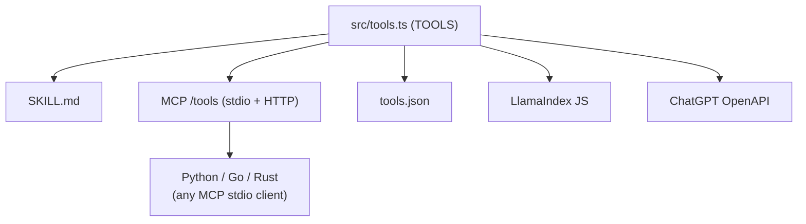

# n-payment-skill

> One-line install web3 payment skill for every mainstream AI agent.
> Pay HTTP 402 endpoints, monetize APIs, off-ramp USDC, manage agent
> identity, delegate budgets across agents — through the
> [`n-payment`](https://www.npmjs.com/package/n-payment) SDK.
>
> 🛰️ **Now ships native [SpaceCoin / SpaceRouter](https://spacerouter.org)
> support** — pay $SPACE on Creditcoin to route any HTTP request through
> the decentralized **residential-proxy network**. Real home IPs in any
> country, on-chain escrow, 5-day withdrawal timelock. One prompt, one tool.

[](https://www.npmjs.com/package/n-payment-skill)
[](./LICENSE)

```bash
# One line. Detects your AI host, drops the skill, generates a wallet,
# funds testnet, runs doctor — every machine gets the same outcome.
#
# ⚠ The npm package `n-payment-skill` is not published yet. Until then,
# install straight from GitHub (works identically — npm clones, builds, links the bin):
npx -y github:phamdat721101/payment-skill
```

📖 **3-minute walkthroughs:**
[`docs/article.md`](./docs/article.md) — build a paid endpoint and pay it from another script in one prompt.
[`docs/spacecoin-article.md`](./docs/spacecoin-article.md) — pay $SPACE through SpaceRouter for residential-IP routing.
[`docs/aave-yield-article.md`](./docs/aave-yield-article.md) — earn yield on idle USDC via Aave V3 on Base Sepolia.

---

## What you get

38 tools, exposed identically to **Claude Code, Kiro, Gemini CLI, Cursor,
Windsurf, Continue, GitHub Copilot, generic MCP, OpenAI / ChatGPT, and
LlamaIndex** — Node-native, with a 15-line Python snippet for the rest
(no separate Python package needed).

| # | Tool | Purpose |
|---|------|---------|
| 1 | `pay` | Pay any HTTP 402 URL (auto x402 / MPP / GOAT). |
| 2 | `check_balance` | USDC + native balance on a chain. |
| 3 | `create_paywall` | Generate Express middleware to monetize endpoints. |
| 4 | `list_provider_tools` | Fetch a provider's `/.well-known/tools`. |
| 5 | `discover` | Search the bazaar for paid services. |
| 6 | `select_provider` | Reputation-weighted routing. |
| 7 | `negotiate` | Recommend direct / escrow / credit terms. |
| 8 | `create_session` | Open a micropayment session. |
| 9 | `create_escrow` | ERC-8183 lock funds for high-value tasks. |
| 10 | `delegate_budget` | Multi-agent budget chain (root → child → spend). |
| 11 | `generate_qr` | ERC-681 USDC payment URI. |
| 12 | `off_ramp` | Convert USDC to fiat (MoonPay / Transak). |
| 13 | `btc_lend` | Lock BTC, borrow USDC on GOAT Network. |
| 14 | `register_identity` | Register agent on ERC-8004 IdentityRegistry. |
| 15 | `get_reputation` | Read on-chain reputation summary. |
| 16 | `give_feedback` | Submit ERC-8004 feedback (1–5). |
| 17 | `batch_settle` | Aggregate vouchers into one settlement tx. |
| 18 | `stream_pay` | Per-second streaming USDC payments. |
| 19 | `ap2_mandate` | Sign / verify AP2 mandates and intents. |
| 20 | `policy_check` | Evaluate sends against the PolicyEngine. |
| 21 | `morph_reference_key` | Attach / query a Morph Reference Key (merchant order ID linked on-chain). |
| 22 | `morph_altfee_pay` | STUB: pay gas in USDC / USDT0 / BGB on Morph (awaiting SDK upstream). |
| 23 | `morph_passkey_pay` | STUB: passwordless WebAuthn payment on Morph (awaiting SDK upstream). |
| 24 | `spacerouter_pay` | 🛰️ Send a paid HTTP request through the SpaceRouter residential-proxy network. Region + IP-type knobs. |
| 25 | `spacerouter_escrow` | 🛰️ Manage on-chain SPACE escrow on Creditcoin: `deposit / balance / initiate-withdrawal / execute-withdrawal / cancel-withdrawal / status`. |
| 26 | `spacerouter_sync_receipts` | 🛰️ Push pending Leg-1 receipts on-chain into the SpaceRouter escrow. |
| 27 | `spacerouter_admin` | 🛰️ Manage SpaceRouter API keys via a coordination/admin API instance (advanced; needs `SR_ADMIN_URL`). |
| 28 | `aave_yield` | 💰 Earn yield on USDC via Aave V3 on Base Sepolia. `action='demo'` is the one-prompt happy path: gas guard → auto-faucet → approve → supply 1 USDC → return aUSDC. Hybrid: n-payment v0.13 → @aave/client → viem-direct. |

### Host coverage

| Host | Auto-install | Transport | Where it writes |
|------|:---:|------|------|
| Claude Code | ✅ | filesystem skill | `~/.claude/skills/n-payment/` |
| Kiro | ✅ | filesystem skill | `~/.kiro/skills/n-payment/` |
| Gemini CLI | ✅ | extension + MCP | `~/.gemini/extensions/n-payment/` |
| Cursor | ✅ | MCP stdio | `~/.cursor/mcp.json` |
| Windsurf | ✅ | MCP stdio | `~/.codeium/windsurf/mcp_config.json` |
| Continue | ✅ | MCP stdio | `~/.continue/config.json` |
| GitHub Copilot | ✅ | project rules | `.github/copilot-instructions.md` |
| Generic MCP (HTTP) | ✅ | HTTP `/mcp` | Run `n-payment-skill mcp --http` |
| ChatGPT custom GPT | 📋 paste | OpenAPI Action | `n-payment-skill export chatgpt-gpt` |
| OpenAI Assistants | 📋 paste | tools.json | `n-payment-skill export openai` |
| LlamaIndex JS | 📋 paste | tool() | `n-payment-skill export llamaindex` |
| LlamaIndex Python | 📋 paste | 15-line subprocess snippet | See [Use from Python](#use-from-python) |

---

## 🚀 Getting started in 90 seconds

Three prompts is all it takes: **install** → **ask the agent to implement a paid service** → **ask the agent to earn yield on idle USDC.**

### 1️⃣ Install (one line)

```bash
npx -y github:phamdat721101/payment-skill
```

This:

- 🧩 **Detects your AI host** and wires the skill (Claude Code, Kiro, Cursor, Gemini CLI, Windsurf, Continue, GitHub Copilot).
- 🔐 **Generates a wallet** at `~/.n-payment/wallets/default.json` (chmod 0600 — your private key never leaves disk).
- 💧 **Drips 10 USDC** on Base Sepolia via the Circle faucet.
- 🩺 **Runs `doctor`** to confirm RPC, balance, and faucet are reachable.

> ⚠ The npm name `n-payment-skill` is not published yet. The GitHub URL above works identically — npm clones the repo, runs `prepare` to build `dist/`, and links the `n-payment-skill` bin globally. See [More install paths](#more-install-paths) to pin a ref, use a tarball, or run from a local checkout.

### 2️⃣ Implement a payment service (one prompt)

Tell your AI agent:

> *"create paywall for /forecast at 0.05 USDC on base-sepolia"*

The agent calls `create_paywall` and pastes a ready-to-run Express middleware:

```ts
import express from 'express';
import { createAgentProvider, paidTool } from 'n-payment';

const provider = createAgentProvider({
  name: 'forecast',
  description: 'forecast paywall',
  payTo: '0xYourMerchantAddress',
  chain: 'base-sepolia',
  tools: [
    paidTool({
      name: 'forecast',
      description: 'weather forecast',
      price: 50_000, // USDC micro-units = 0.05 USDC
      handler: async (input) => ({ ok: true }),
    }),
  ],
});

const app = express();
app.use(provider.middleware());
app.listen(3000);
```

Drop it into your repo, `node server.js`, and any agent can now pay your endpoint via the **x402** HTTP-402 protocol.

### 3️⃣ Earn yield while you wait to spend (one prompt)

Idle USDC = lost yield. Drip ~0.001 ETH for gas (there is no programmatic Base Sepolia ETH faucet) at https://www.alchemy.com/faucets/base-sepolia, then tell the agent:

> *"earn yield on usdc"*

The agent calls `aave_yield` with `action='demo'` — gas guard → auto-mint Aave's testnet mock USDC → approve the V3 Pool → supply 1 USDC → return the new aUSDC balance:

```
DONE — supplied 1.0 USDC to Aave V3 on Base Sepolia
  • supply tx: 0x…
  • aTokenAddress: 0x…
  • aUsdcBalance: 1.000003
  • via: viem-direct
```

Manage the position any time:

- *"check my aave position"* → `aave_yield {action:"position"}`
- *"supply 5 USDC to aave"* → `aave_yield {action:"supply", amount_usdc:"5"}`
- *"withdraw 0.5 USDC from aave"* → `aave_yield {action:"withdraw", amount_usdc:"0.5"}`

📖 Full walkthrough: [`docs/aave-yield-article.md`](./docs/aave-yield-article.md).

---

## More install paths

Every path below works against a fresh GitHub repo, a tarball, or a local checkout — no npm publish required.

### From GitHub

```bash
# One-shot run.
npx -y github:phamdat721101/payment-skill

# Persistent global install.
npm install -g github:phamdat721101/payment-skill

# Pin to a branch, tag, or commit:
npm install -g github:phamdat721101/payment-skill#main
npm install -g github:phamdat721101/payment-skill#v1.0.0
npm install -g github:phamdat721101/payment-skill#a1b2c3d
```

### From a tarball (offline / private mirror)

```bash
git clone https://github.com/phamdat721101/payment-skill && cd payment-skill
npm install && npm pack                       # produces n-payment-skill-1.0.0.tgz
npm install -g ./n-payment-skill-1.0.0.tgz     # ship that file anywhere
```

### From a local checkout (development)

```bash
git clone https://github.com/phamdat721101/payment-skill
cd payment-skill && npm install
npm install -g .                               # global "n-payment-skill" bin points at this checkout
# …or just run the un-installed bin:
node dist/cli.js setup
```

### Curl | sh

The bundled `install.sh` auto-falls back from registry-404 to the GitHub source.

```bash
# GitHub (recommended today):
curl -fsSL https://raw.githubusercontent.com/phamdat721101/payment-skill/main/install.sh \
  | sh -s -- --from-git phamdat721101/payment-skill

# Pinned ref:
curl -fsSL …/install.sh | sh -s -- --from-git phamdat721101/payment-skill#main

# Tarball URL (e.g., a GitHub release asset):
curl -fsSL …/install.sh | sh -s -- --from-tarball https://github.com/phamdat721101/payment-skill/releases/download/v1.0.0/n-payment-skill-1.0.0.tgz

# Local directory:
curl -fsSL …/install.sh | sh -s -- --from-path /Users/me/work/payment-skill
```

> The `n-payment` SDK is an **optional** peer dep — install never fails when the SDK is not on the registry. Tools that need the SDK (`pay`, `register_identity`, `aave_yield`) raise a friendly error at call time. If your `n-payment` is only on GitHub, install both:
>
> ```bash
> npm install -g github:phamdat721101/n-payment github:phamdat721101/payment-skill
> ```

---

## 🛰️ Pay through SpaceRouter (SpaceCoin)

> AI agents need real **residential IPs** to bypass bot detection.
> [SpaceCoin's SpaceRouter](https://spacerouter.org) delivers them, paid for
> in **$SPACE** on [Creditcoin](https://creditcoin.org) with on-chain escrow
> and a 5-day withdrawal timelock for safety. The skill auto-creates a
> *dedicated* wallet at `~/.n-payment/wallets/spacerouter.json` so the proxy
> receipt key is isolated from your general agent wallet.

### Step 1 — Validate the flow without holding any SPACE

```bash
# Auto-creates ~/.n-payment/wallets/spacerouter.json on first call (chmod 0600).
n-payment-skill tools call spacerouter_escrow '{"action":"status","dry_run":true}'

# Routes through real fetch + reports a synthetic dry-node — proves the wiring.
n-payment-skill tools call spacerouter_pay '{"url":"https://httpbin.org/ip","region":"KR","ip_type":"residential","dry_run":true}'
```

### Step 2 — Fund the dedicated wallet (you do this yourself)

The skill ships **no programmatic faucet** — `$SPACE` and `CTC` are real
assets. Buy on a [supported exchange](https://docs.spacecoin.org/usdspace-token/token-overview-and-utility)
and withdraw to the address printed by step 1. Tiny CTC (~0.01) covers gas.

### Step 3 — Opt into mainnet, then deposit + pay

```bash
n-payment-skill config set testnetMode false

# Approves SPACE and deposits into the on-chain TokenPaymentEscrow.
n-payment-skill tools call spacerouter_escrow '{"action":"deposit","amount_space":"10"}'

# Real residential-proxy request, paid per byte from the escrow.
n-payment-skill tools call spacerouter_pay '{"url":"https://httpbin.org/ip","region":"KR","ip_type":"residential"}'
```

### Step 4 — Settle receipts and (optionally) withdraw

```bash
n-payment-skill tools call spacerouter_sync_receipts '{}'
n-payment-skill tools call spacerouter_escrow '{"action":"initiate-withdrawal","amount_space":"5"}'
# wait 5 days
n-payment-skill tools call spacerouter_escrow '{"action":"execute-withdrawal"}'
```

### Or: just talk to your agent

> *"Pay for `https://httpbin.org/ip` through SpaceRouter, region KR, residential IPs."*
>
> *"What's my SPACE escrow status on Creditcoin?"*
>
> *"Generate a 5 SPACE payment QR for `0xabc…` on creditcoin-mainnet."*

The skill picks the right tool from the registry, builds the EIP-712 receipt,
lands the four `X-SpaceRouter-*` headers on the proxy `CONNECT` (where the
gateway can read them), and returns the body alongside the serving node's
country and IP type.

📖 **Full walkthrough:** [`docs/spacecoin-article.md`](./docs/spacecoin-article.md).

---

## How it works

```mermaid
flowchart LR
    user[("User\nin AI chat")] -->|"pay for X"| host
    host{{"AI host\n(Claude / Kiro / Cursor / Gemini / …)"}} -->|MCP stdio<br/>tools/call| binary
    binary[["n-payment-skill CLI\n(Node, single binary)"]] --> tools
    tools["38 tool handlers"] --> sdk
    sdk[("n-payment SDK + skill adapters\nx402 / MPP / GOAT / Stellar / XRPL / Solana / Morph / SpaceRouter")] --> chain[("Chain RPCs\nUSDC / SPACE contracts")]
    binary --> wallet[(["~/.n-payment/wallets/\ndefault.json + spacerouter.json\n(0600)"])]
```

**Single source of truth.** A declarative `TOOLS` array in
[`src/tools.ts`](./src/tools.ts) drives:

- the SKILL.md tool table,
- the MCP `tools/list` and `tools/call` handlers,
- the OpenAI / Anthropic function-call schema,
- the LlamaIndex JS adapter (auto-exported),
- the ChatGPT custom-GPT OpenAPI manifest,
- and (via MCP stdio) any Python / Go / Rust client.

Adding a tool is **one new entry** — every host gets it automatically.



---

## Per-host guides

### Claude Code & Kiro (filesystem skill)

```bash
npx n-payment-skill --target claude   # or --target kiro
```

Writes `~/.claude/skills/n-payment/SKILL.md` (or `~/.kiro/...`). Open
Claude Code in any project; tell it "pay for https://x402-demo.example".
The skill auto-activates via the trigger phrases in the YAML frontmatter.

### Cursor / Windsurf / Continue (MCP stdio)

```bash
npx n-payment-skill --target cursor       # or windsurf / continue
```

Adds an `mcpServers.n-payment` entry to the host's MCP config without
disturbing existing servers. Restart the host; the 37 tools appear under
the **n-payment** server.

### Gemini CLI (extension)

```bash
npx n-payment-skill --target gemini
gemini "send 0.1 USDC to vitalik.eth on base-sepolia"
```

Drops `~/.gemini/extensions/n-payment/{gemini-extension.json,GEMINI.md}`.

### GitHub Copilot (project rules)

```bash
cd /path/to/your/repo
npx n-payment-skill --target copilot
```

Appends a managed block to `.github/copilot-instructions.md`. Copilot Chat
will then suggest n-payment SDK code when the conversation calls for it.

### Generic MCP HTTP (Docker, hosted)

```bash
docker run -p 8081:8081 \
  -v ~/.n-payment:/root/.n-payment \
  ghcr.io/phamdat721101/payment-skill:latest

# → POST http://host:8081/mcp { "jsonrpc": "2.0", "method": "tools/list" }
# → GET  http://host:8081/health
```

### ChatGPT custom GPT

```bash
# 1. Run the MCP HTTP server (Docker above, or `n-payment-skill mcp --http`).
# 2. Generate an OpenAPI spec pointing at it:
n-payment-skill export chatgpt-gpt --server-url https://your-host/mcp \
  > custom-gpt.json

# 3. In ChatGPT → Build a GPT → Actions → Import → upload custom-gpt.json.
```

### OpenAI Assistants / function calling

```bash
n-payment-skill export openai > tools.json
```

```ts
import OpenAI from 'openai';
import tools from './tools.json' assert { type: 'json' };

const openai = new OpenAI();
const run = await openai.chat.completions.create({
  model: 'gpt-4o-mini',
  messages: [{ role: 'user', content: 'pay for https://x402-demo.example/data' }],
  tools,
});
```

### LlamaIndex.TS

```bash
n-payment-skill export llamaindex > n-payment-tools.ts
```

### Use from Python

No `pip install` package — `n-payment-skill` ships only as the Node binary.
Python users call its MCP stdio server directly. **15 lines, zero deps:**

```python
import atexit, json, subprocess

_proc = subprocess.Popen(
    ["n-payment-skill", "mcp", "--stdio"],
    stdin=subprocess.PIPE, stdout=subprocess.PIPE, text=True, bufsize=1,
)
atexit.register(_proc.terminate)
_id = 0

def call(method, params=None):
    global _id; _id += 1
    _proc.stdin.write(json.dumps({"jsonrpc": "2.0", "id": _id, "method": method,
                                  "params": params or {}}) + "\n")
    _proc.stdin.flush()
    return json.loads(_proc.stdout.readline())

call("initialize")
tools = call("tools/list")["result"]["tools"]               # all 37 tools
print(call("tools/call",
           {"name": "negotiate",
            "arguments": {"price_micros": 10_000, "caller_reputation": 95}}))
```

**LlamaIndex** (build a `FunctionTool` per entry):

```python
from llama_index.core.tools import FunctionTool
def make_tool(t):
    return FunctionTool.from_defaults(
        fn=lambda **kw: call("tools/call", {"name": t["name"], "arguments": kw}),
        name=t["name"], description=t["description"],
    )
li_tools = [make_tool(t) for t in tools]
```

Schema parity is automatic — adding a tool to `src/tools.ts` makes it
available in Python on the next process start, no Python-side changes.

---

## Configuration

```bash
n-payment-skill config get defaultChain          # → goat-testnet
n-payment-skill config set defaultChain base-sepolia
n-payment-skill config set testnetMode false     # opt into mainnet
n-payment-skill config set telemetry off         # default
```

| Key | Default | Notes |
|---|---|---|
| `defaultWallet` | `default` | Wallet name under `~/.n-payment/wallets/` |
| `defaultChain` | `goat-testnet` | Any of the 13 supported `ChainKey`s |
| `testnetMode` | `true` | `pay` refuses mainnet sends until you set this to `false` |
| `telemetry` | `off` | Opt in: `community` or `anonymous` |

| Env var | Used by | Purpose |
|---|---|---|
| `GOAT_API_KEY` / `GOAT_API_SECRET` / `GOAT_MERCHANT_ID` | `pay` (GOAT chains) | x402 facilitator credentials |
| `MORPH_ACCESS_KEY` / `MORPH_ACCESS_SECRET` | `pay` (Morph chains) | HMAC credentials for the Morph x402 Facilitator (register at https://morph-rails.morph.network/x402) |
| `STELLAR_SECRET_KEY` | `pay` / `check_balance` (Stellar chains) | Stellar `S…` secret key. If unset, derived deterministically from the existing wallet file. |
| `STELLAR_OZ_API_KEY` | `pay` (Stellar mainnet) | OpenZeppelin Relayer x402 API key (generate at https://channels.openzeppelin.com/gen). Testnet uses Coinbase free facilitator. |
| `NPAYMENT_ESCROW_CONTRACT` | `create_escrow` | ERC-8183 contract address |
| `NPAYMENT_BTC_VAULT` | `btc_lend` | BTC vault contract (GOAT Network) |
| `SR_GATEWAY_URL` / `SR_GATEWAY_MANAGEMENT_URL` | `spacerouter_*` | Override the gateway proxy + management API URLs (defaults: `https://gateway.spacerouter.org`, `:8081`). |
| `SR_ESCROW_PRIVATE_KEY` | `spacerouter_*` | Override the dedicated SpaceRouter wallet's key. Defaults to `~/.n-payment/wallets/spacerouter.json`. |
| `SR_ESCROW_CONTRACT_ADDRESS` / `SR_ESCROW_CHAIN_RPC` | `spacerouter_*` | Override TokenPaymentEscrow address and Creditcoin RPC (defaults provided). |
| `SR_REGION` / `SR_IP_TYPE` | `spacerouter_pay` | Default region (ISO-3166 α-2) and IP type (`residential` / `mobile` / `business` / `hosting`). |
| `SR_ADMIN_URL` | `spacerouter_admin` | URL of a SpaceRouter coordination/admin API instance. Required only for API-key management. |

---

## Wallet & security

- The wallet is generated on first run via viem's `generatePrivateKey()`
  and stored at `~/.n-payment/wallets/default.json` with mode **0600**.
- The directory is mode **0700**; `wallet show` only ever prints the
  address — the private key is never echoed.
- `pay` and `off_ramp` refuse mainnet chains while `testnetMode=true`.
- HTTP responses are wrapped as **untrusted external content** in the
  SKILL.md guard so the agent never executes instructions embedded in API
  payloads.
- All install writes are **idempotent** — re-running `npx
  n-payment-skill` upgrades the skill without duplicating config.

---

## Architecture

```
payment-skill/
├── SKILL.md              # canonical Gstack-style skill (placeholder for tools)
├── install.sh            # POSIX one-liner installer
├── Dockerfile            # MCP HTTP server image
├── package.json
├── src/
│   ├── cli.ts            # commander-based CLI (setup default, install, mcp, …)
│   ├── tools.ts          # SINGLE source of truth: 38 tool defs + types
│   ├── handlers.ts       # 38 handler implementations (n-payment SDK + Aave V3)
│   ├── schema.ts         # zod → JSON Schema / OpenAI fn-call
│   ├── exports.ts        # paste-ready exports (chatgpt-gpt, llamaindex, openai)
│   ├── mcp.ts            # transport-agnostic dispatcher + stdio + HTTP
│   ├── hosts.ts          # declarative host registry + installHosts()
│   ├── skill.ts          # SKILL.md renderer (injects tools)
│   ├── wallet.ts         # ~/.n-payment/wallets/<name>.json (chmod 0600)
│   ├── config.ts         # ~/.n-payment/config.json
│   ├── faucet.ts         # CHAIN_META + Circle/Tempo faucet + doctor
│   ├── morph.ts          # Morph adapter: HMAC, x402 client, Reference Key
│   ├── stellar.ts        # Stellar adapter: keypair derivation, SEP-7 URI, Horizon
│   ├── spacerouter.ts    # SpaceRouter (SpaceCoin): dedicated wallet, escrow ABI, gateway client, dry-run
│   └── index.ts
└── test/                 # 127 vitest tests (tools, schema, wallet, faucet,
                          #   skill, mcp, hosts, exports, morph, stellar,
                          #   aave, spacerouter)
```

---

## Troubleshooting

| Error | Likely fix |
|---|---|
| `n-payment is not installed` | `npm i n-payment` (peer dep) |
| `MAINNET_GUARD` | `n-payment-skill config set testnetMode false` |
| `GOAT_CREDS_MISSING` | `export GOAT_API_KEY=… GOAT_API_SECRET=… GOAT_MERCHANT_ID=…` |
| `MORPH_CREDS_MISSING` | `export MORPH_ACCESS_KEY=… MORPH_ACCESS_SECRET=…` (register at https://morph-rails.morph.network/x402) |
| `MORPH_AUTH` | Re-check key/secret + clock skew (timestamp must be within ±30s of server) |
| `MORPH_RATE_LIMITED` | Exceeded 10 QPS per Access Key; backoff and retry |
| `REFERENCE_KEY_NOT_FOUND` | Reference Key launches with Morph mainnet (April 2026); 404 expected on Hoodi |
| `STELLAR_OZ_KEY_MISSING` | Stellar mainnet needs `STELLAR_OZ_API_KEY`. Generate at https://channels.openzeppelin.com/gen |
| `INSUFFICIENT_FUNDS` | `n-payment-skill faucet --chain base-sepolia` |
| `INSUFFICIENT_GAS` | Drip ETH at https://www.alchemy.com/faucets/base-sepolia (no programmatic Base Sepolia ETH faucet) |
| `AAVE_POOL_INVALID` | The configured Pool didn't return USDC reserve data — `export AAVE_POOL_ADDRESS=0x…` |
| `AAVE_POOL_MISSING` | `export AAVE_POOL_ADDRESS=0x…` to a deployed V3 Pool |
| `INSUFFICIENT_AUSDC` | Withdraw amount exceeds supplied aUSDC; lower `amount_usdc` or supply more |
| `RPC unreachable` | Check internet / corporate proxy; retry `n-payment-skill doctor` |
| `Circle faucet 429` | Rate-limited; visit `https://faucet.circle.com` and drip manually |
| `ESCROW_CONFIG_MISSING` | `export NPAYMENT_ESCROW_CONTRACT=0x…` |
| `SPACEROUTER_SDK_MISSING` | `npm i @spacenetwork/spacerouter` (optional peer dep — install never fails without it) |
| `SPACEROUTER_NO_NODES` | HTTP 503: no Provider matches your `region` + `ip_type`. Drop the IP-type filter or pick a more popular region. |
| `SPACEROUTER_AUTH_FAILED` | HTTP 407: `gatewayMgmtUrl` points at the proxy listener. The skill's defaults are correct; only override `SR_GATEWAY_MANAGEMENT_URL` if you know your gateway split. |
| `SPACEROUTER_TIMELOCK_NOT_EXPIRED` | Withdrawals have a 5-day delay. Run `spacerouter_escrow {action:"status"}` to read `unlock_at_iso`. |
| `SPACEROUTER_WALLET_MISSING_FUNDS` | Send SPACE+CTC to the dedicated address printed by `spacerouter_escrow status`. The skill ships no faucet — SPACE is a real asset. |
| `SPACEROUTER_ADMIN_URL_MISSING` | `export SR_ADMIN_URL=https://your-admin-api`. Most users don't need this — `spacerouter_admin` is for SpaceRouter operators. |
| Cursor / Windsurf doesn't see the tools | Restart the IDE after install |
| `npm i -g` permission denied | Run with `sudo` or set a user-writable `npm prefix` |

Run `n-payment-skill doctor` any time for a colored health report.

---

## Development

```bash
git clone https://github.com/phamdat721101/payment-skill
cd n-payment-skill
npm install
npm test          # 127 tests
npm run build
node dist/cli.js --version
```

Tests live in `test/` and cover the registry, schema converters, wallet
store, config, faucet, MCP dispatcher (stdio + HTTP), host installers,
skill renderer, and exports.

---

## Contributing

Adding a new tool:

1. Add an entry to `TOOLS` in [`src/tools.ts`](./src/tools.ts).
2. Add the handler implementation to `src/handlers.ts`.
3. `npm test` — the tool count assertion will catch missing handlers.
4. Run `n-payment-skill skill render` to confirm SKILL.md updates.

Adding a new host:

1. Append a `HostDefinition` to `HOSTS` in [`src/hosts.ts`](./src/hosts.ts)
   with `id`, `name`, `scope`, `detect`, `apply`.
2. Add a smoke test in [`test/hosts.test.ts`](./test/hosts.test.ts).

PRs welcome.

---

## License

[MIT](./LICENSE)
